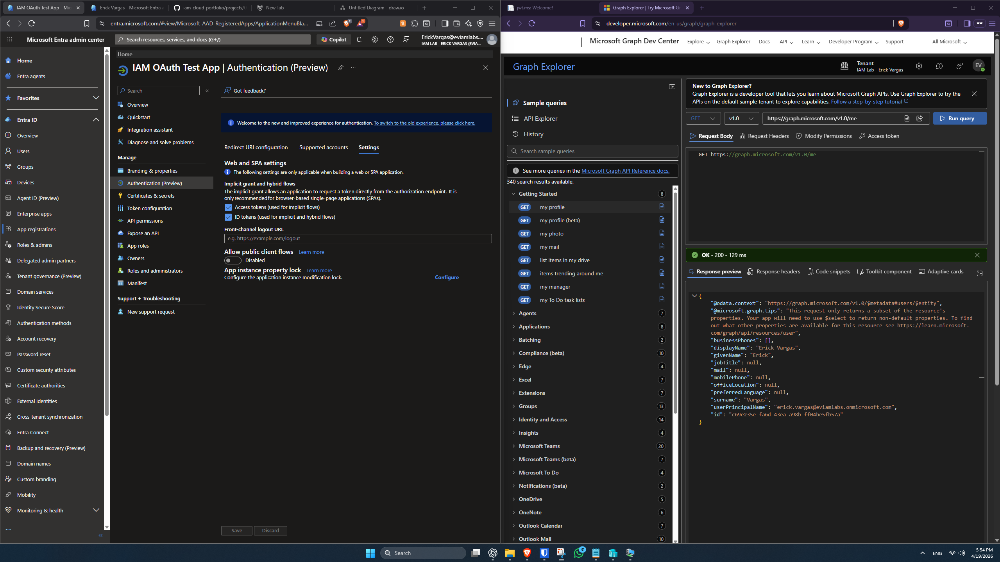
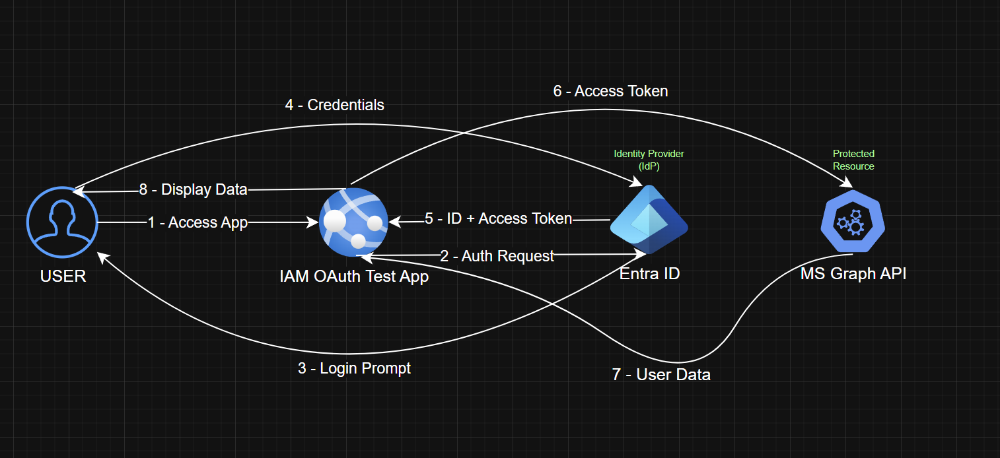

# OAuth 2.0 & OpenID Connect Authentication – Microsoft Entra ID

## 🎯 Objective

Implement and understand modern authentication using OAuth 2.0 and OpenID Connect (OIDC) with Microsoft Entra ID, including token generation and API authorization.

---

## 📌 Scope

* App Registration in Entra ID
* OAuth 2.0 Authorization Flow
* OpenID Connect (OIDC) authentication
* Token-based authentication (ID Token, Access Token)
* API authorization using Microsoft Graph

---

## 🧠 Key Concepts

* **Authorization Server:** Microsoft Entra ID
* **Client Application:** IAM OAuth Test App
* **Resource:** Microsoft Graph API
* **Tokens:**

  * ID Token → Authentication (who the user is)
  * Access Token → Authorization (what the user can access)

---

## 🔧 App Registration

An application was registered in Microsoft Entra ID to act as an OAuth client.

### Configuration:

* **Name:** IAM OAuth Test App
* **Redirect URI:** https://jwt.ms
* **Supported Accounts:** Single tenant

This application is used to simulate authentication and token issuance.

---

## 🔑 Token Generation and Authentication Flow

An OpenID Connect authentication flow was executed to generate an ID token.

### Steps:

1. User authenticated via Entra ID
2. Authorization request sent to Entra endpoint
3. ID token returned to application
4. Token decoded using jwt.ms

---

## 🔍 Token Comparison (Scopes Impact)

### Minimal Token (scope = openid)

* Contains only basic identity claims
* Uses `sub` as unique identifier

---

### Expanded Token (scope = openid profile email)

* Includes additional user information:

  * name
  * preferred_username
  * email

---

## 🧠 Key Insight

Token contents depend on requested scopes. Additional claims are only included when explicitly requested.

---

## 🔑 Access Token and API Authorization

An OAuth 2.0 access token was generated and used to call Microsoft Graph API.

### Scope:

* User.Read

### API Call:

GET https://graph.microsoft.com/v1.0/me

---

## 🌐 API Authorization Test

The access token was used to successfully call Microsoft Graph API.

### Result:

User profile information was retrieved, confirming successful authorization.

---

## 🔄 OAuth 2.0 & OpenID Connect Flow

### Authentication and Authorization Process

1. User attempts to access the application
2. Application redirects user to Microsoft Entra ID
3. User authenticates with Entra ID
4. Entra ID issues:

   * ID Token (authentication)
   * Access Token (authorization)
5. Application uses Access Token to call Microsoft Graph API
6. API validates token and returns user data

---

## 📊 Architecture Diagram

---

## 🧠 Final Understanding

* ID Token proves **who the user is**
* Access Token defines **what the user can access**
* OAuth 2.0 enables secure **API authorization**
* OpenID Connect enables **user authentication**
* Microsoft Entra ID acts as the **Identity Provider (IdP)**

---

## 📅 Execution Timeline

* Implemented: April 2026

---

## 🚀 Status

✅ Completed
