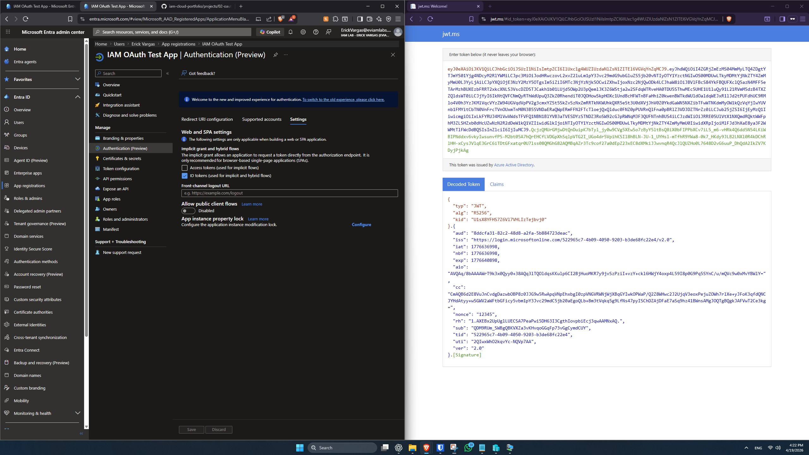
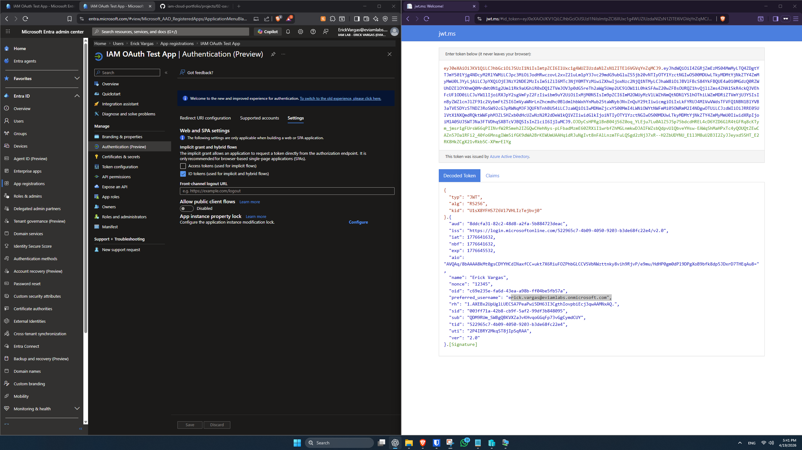

# OAuth 2.0 & OpenID Connect Authentication – Microsoft Entra ID

## Objective
Implement and understand modern authentication using OAuth 2.0 and OpenID Connect (OIDC) with Microsoft Entra ID.

---

## Scope
- App Registration in Entra ID
- OAuth 2.0 Authorization Flow
- OpenID Connect (OIDC) authentication
- Token-based authentication (ID Token, Access Token)

---

## Key Concepts
- Authorization Server: Microsoft Entra ID
- Client Application: Registered App
- Resource: Microsoft Graph or API
- Tokens:
  - ID Token (authentication)
  - Access Token (authorization)

---

## 🔧 App Registration

An application was registered in Microsoft Entra ID to act as an OAuth client.

### Configuration:
- Name: IAM OAuth Test App
- Redirect URI: https://localhost
- Supported Accounts: Single tenant

This app will be used to simulate OAuth 2.0 and OpenID Connect authentication flows.

---

## 🔍 Token Comparison (Scopes Impact)

### Minimal Token (scope = openid)
- Contains only basic identity claims
- Uses `sub` as unique identifier

---

### Expanded Token (scope = openid profile email)
- Includes additional user information:
  - name
  - preferred_username
  - email

---

## Key Insight
Token contents depend on requested scopes. Additional claims are only included when explicitly requested.

---

## Status
🚧 In progress
