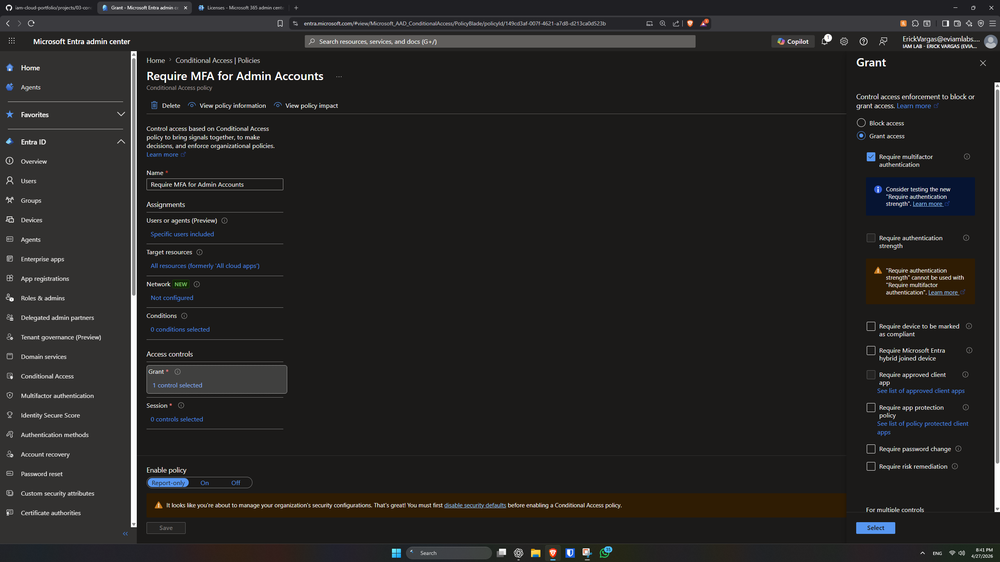
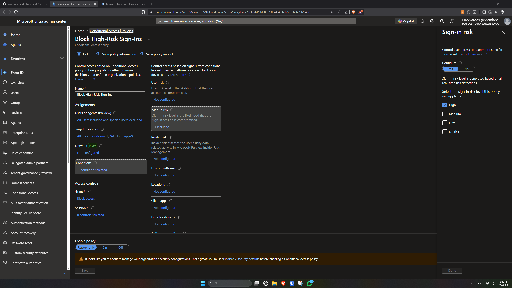
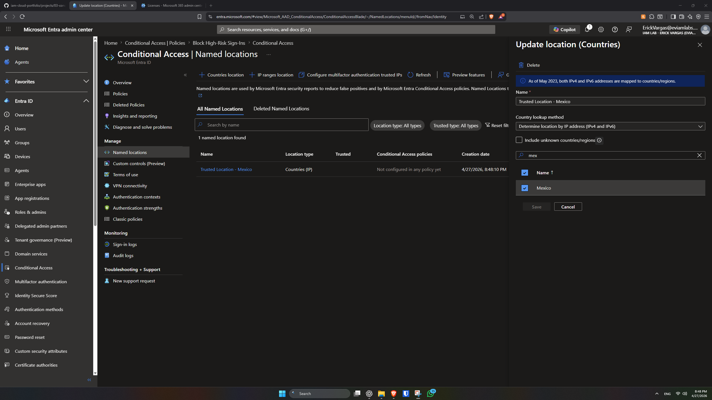
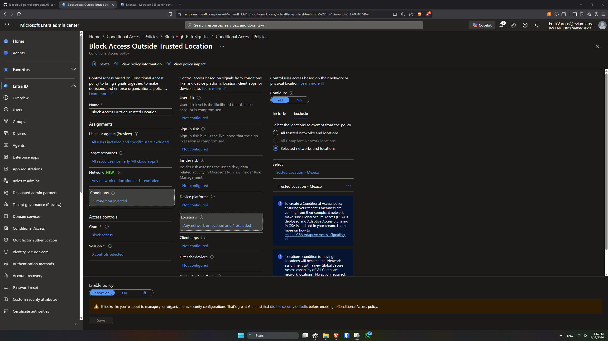
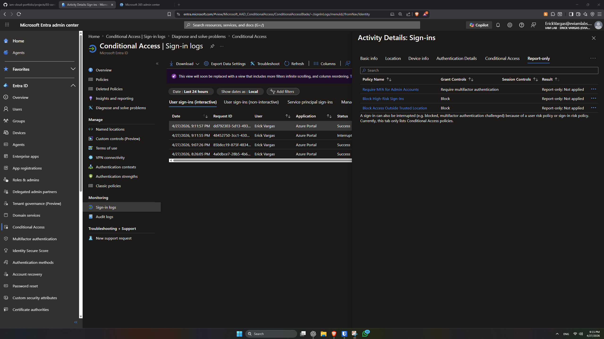
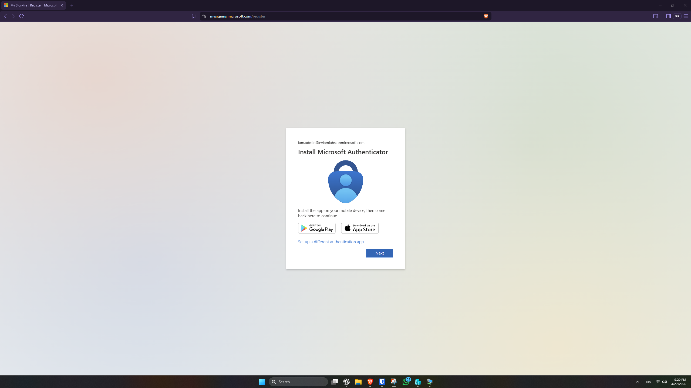
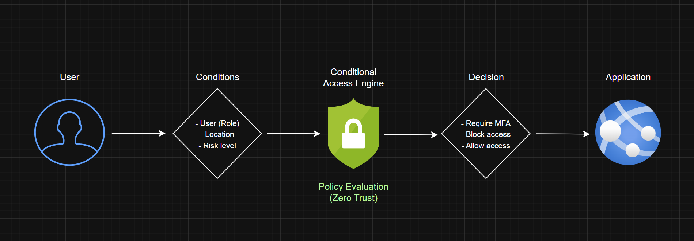

# Conditional Access & Zero Trust – Microsoft Entra ID

## 🎯 Objective

Implement Conditional Access policies to enforce secure access controls based on Zero Trust principles, including MFA, risk-based, and location-based access.

---

## 📌 Scope

* Conditional Access policy creation
* Multi-Factor Authentication (MFA) enforcement
* Risk-based access control
* Location-based access control
* Policy validation and safe enforcement

---

## 🧠 Key Concepts

* Conditional Access
* Multi-Factor Authentication (MFA)
* Zero Trust Model
* Policy-based access control
* Risk-based authentication

---

## 🔐 Conditional Access Policies

### 1. MFA for Admin Accounts

* **Users:** iam.admin
* **Applications:** All cloud apps
* **Control:** Require MFA
* **Mode:** Enforced

---

### 2. Block High-Risk Sign-Ins

* **Users:** All users
* **Applications:** All cloud apps
* **Condition:** High sign-in risk
* **Control:** Block access
* **Mode:** Report-only

---

### 3. Location-Based Access Control

* **Named Location:** Trusted Location - Mexico
* **Users:** All users
* **Applications:** All cloud apps
* **Condition:** Any location excluding trusted location
* **Control:** Block access
* **Mode:** Report-only

---

## 🧪 Validation and Testing

Policies were first deployed in report-only mode to evaluate their impact without affecting users.

### Validation Steps:

* Reviewed sign-in logs
* Analyzed Conditional Access evaluation results

---

## 🚀 Enforcement

The MFA policy for admin accounts was enabled and tested.

### Result:

* Admin users are required to complete MFA during login

---

## 🧠 Zero Trust Model

This implementation follows Zero Trust principles:

* Never trust by default
* Always verify identity
* Evaluate risk and context before granting access

---

## 📊 Architecture Diagram

---

## 🧠 Key Insights

* Access decisions should consider identity, location, and risk
* Policies should be tested before enforcement
* Privileged accounts require stronger controls
* Conditional Access is central to Zero Trust architecture

---

## 📅 Execution Timeline

* Implemented: April 2026

---

## 🚀 Status

✅ Completed
